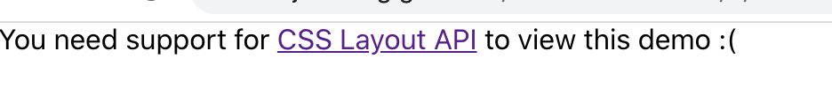
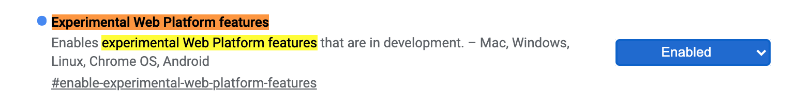

# react-css-houdini
use houdini in React:

includes: 
- registerProperty api
- paintWorklet api
- layoutWorklet api

Try the [demo](https://minjiechang.github.io/react-css-houdini)

```sh
git clone https://github.com/MinjieChang/react-css-houdini.git
cd react-css-houdini
yarn install # or npm install
yarn start # or npm start
```

if you open browser and look like this:



it means that you need to visit __chrome://flags/__, take Google's browser for example, and set `Experimental Web Platform features` from **default** to **enabled**.



then relaunch the chrome

## References

[w3c](https://developer.mozilla.org/en-US/docs/Web/API/CSS_Painting_API/Guide)<br>
[MDN](https://developer.mozilla.org/en-US/docs/Web/Houdini)<br>
[polyfill pain](https://www.w3ctech.com/topic/1979)<br>
[GoogleChromeLabs](https://github.com/GoogleChromeLabs/houdini-samples)<br>
[houdini-samples](https://googlechromelabs.github.io/houdini-samples/)<br>
[w3c-houdini](https://www.w3cplus.com/css/css-houdini.html)<br>
[houdini-quickstart](http://www.danielcwilson.com/blog/2018/02/houdini-quickstart/)<br>

